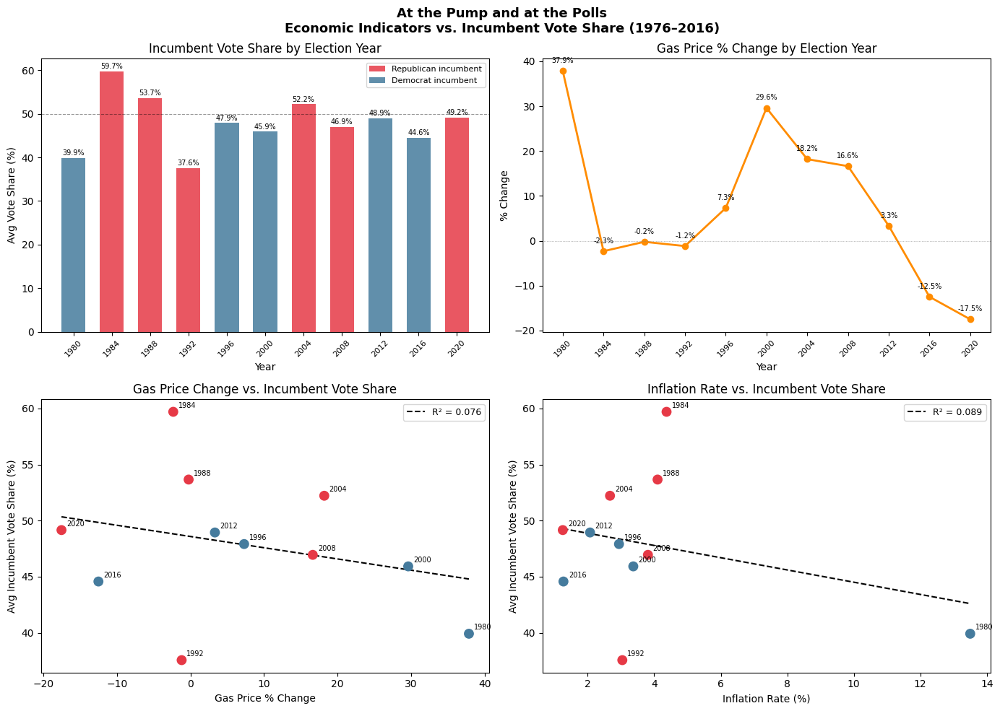

```python
# imports

import pandas as pd
import numpy as np
import matplotlib.pyplot as plt
import matplotlib.ticker as mticker
from matplotlib.lines import Line2D
from matplotlib.patches import Patch
from pymongo import MongoClient
from sklearn.linear_model import LinearRegression
from sklearn.metrics import r2_score
from dotenv import load_dotenv
import os
import logging
```


```python
# logging set up 

logging.basicConfig(
    level=logging.INFO,
    format="%(asctime)s [%(levelname)s] %(message)s",
    handlers=[
        logging.FileHandler("analysis.log"),
        logging.StreamHandler()
    ]
)
log = logging.getLogger(__name__)

load_dotenv()
```


    True


### 1. Pulling Data from MongoDB


```python
try:
    mongo_uri = os.getenv("MONGO_URI")
    if not mongo_uri:
        raise ValueError("MONGO_URI not found in .env file")

    client = MongoClient(mongo_uri, serverSelectionTimeoutMS=5000) # establishes a connection pool to the Atlas cluster
    client.server_info()
    log.info("Connected to MongoDB successfully")

    collection = client["data_by_design"]["election_economics"]
    df = pd.DataFrame(list(collection.find({}, {"_id": 0}))) # collection.find: returns a cursor of all documents matching the filter ({} = all)
    log.info(f"Loaded {len(df)} documents from MongoDB")

except ValueError as e:
    log.error(f"Configuration error: {e}")
    raise
except Exception as e:
    log.error(f"MongoDB connection failed: {e}")
    raise
```

    2026-04-19 23:20:46,552 [INFO] Connected to MongoDB successfully
    2026-04-19 23:20:46,636 [INFO] Loaded 612 documents from MongoDB


```python
# clean data
before = len(df)
df = df.dropna(subset=["gas_price_change_pct", "inflation_rate"])
dropped = before - len(df)
log.info(f"Dropped {dropped} rows with missing economic indicators (2020)")
log.info(f"Working with {len(df)} documents across {df['year'].nunique()} election years")
```

    2026-04-19 23:20:54,643 [INFO] Dropped 51 rows with missing economic indicators (2020)
    2026-04-19 23:20:54,648 [INFO] Working with 561 documents across 11 election years


### 2. Aggregating to national level


```python
try:
    national = df.groupby(["year", "incumbent_party", "gas_price_change_pct", "inflation_rate"]) \
                 .agg(avg_vote_share=("incumbent_vote_share", "mean")) \
                 .reset_index() \
                 .sort_values("year") # sort_values: sorts the DataFrame by year in ascending order
    log.info(f"Aggregated to national level: {len(national)} election years")
    log.info(f"\n{national.to_string(index=False)}")
except Exception as e:
    log.error(f"Aggregation failed: {e}")
    raise
```

    2026-04-19 23:21:01,018 [INFO] Aggregated to national level: 11 election years
    2026-04-19 23:21:01,023 [INFO] 
     year incumbent_party  gas_price_change_pct  inflation_rate  avg_vote_share
     1980        DEMOCRAT                 37.85           13.50       39.910980
     1984      REPUBLICAN                 -2.33            4.37       59.707059
     1988      REPUBLICAN                 -0.24            4.10       53.662745
     1992      REPUBLICAN                 -1.19            3.04       37.555098
     1996        DEMOCRAT                  7.30            2.94       47.909608
     2000        DEMOCRAT                 29.60            3.37       45.919020
     2004      REPUBLICAN                 18.19            2.67       52.219804
     2008      REPUBLICAN                 16.63            3.81       46.946078
     2012        DEMOCRAT                  3.33            2.07       48.941569
     2016        DEMOCRAT                -12.50            1.27       44.568627
     2020      REPUBLICAN                -17.52            1.25       49.157059


### 3. Correlation matrix


```python
try:
    corr = national[["avg_vote_share", "gas_price_change_pct", "inflation_rate"]].corr()
    log.info(f"Correlation matrix:\n{corr.round(3)}")
except Exception as e:
    log.error(f"Correlation matrix failed: {e}")
    raise
```

    2026-04-19 23:21:09,122 [INFO] Correlation matrix:
                          avg_vote_share  gas_price_change_pct  inflation_rate
    avg_vote_share                 1.000                -0.276          -0.298
    gas_price_change_pct          -0.276                 1.000           0.689
    inflation_rate                -0.298                 0.689           1.000


### 4. Regression: Vote Share &  Gas Price Change


```python
try:
    X_gas = national[["gas_price_change_pct"]].values
    y = national["avg_vote_share"].values

    model_gas = LinearRegression().fit(X_gas, y)
    y_pred_gas = model_gas.predict(X_gas)
    r2_gas = r2_score(y, y_pred_gas) # r2_score: compares predicted vs actual values

    log.info(f"Gas price regression — coef: {model_gas.coef_[0]:.4f}, "
             f"intercept: {model_gas.intercept_:.4f}, R²: {r2_gas:.4f}")
    log.info(f"Interpretation: A 1% increase in gas prices is associated with a "
             f"{model_gas.coef_[0]:.3f}% change in incumbent vote share")
except Exception as e:
    log.error(f"Gas price regression failed: {e}")
    raise
```

    2026-04-19 23:21:14,579 [INFO] Gas price regression — coef: -0.1002, intercept: 48.5844, R²: 0.0760
    2026-04-19 23:21:14,580 [INFO] Interpretation: A 1% increase in gas prices is associated with a -0.100% change in incumbent vote share


### 5. Regression: Vote Share & Inflation Rate


```python
try:
    X_inf = national[["inflation_rate"]].values

    model_inf = LinearRegression().fit(X_inf, y)
    y_pred_inf = model_inf.predict(X_inf)
    r2_inf = r2_score(y, y_pred_inf)

    log.info(f"Inflation regression — coef: {model_inf.coef_[0]:.4f}, "
             f"intercept: {model_inf.intercept_:.4f}, R²: {r2_inf:.4f}")
    log.info(f"Interpretation: A 1% increase in inflation is associated with a "
             f"{model_inf.coef_[0]:.3f}% change in incumbent vote share")
except Exception as e:
    log.error(f"Inflation regression failed: {e}")
    raise
```

    2026-04-19 23:21:25,830 [INFO] Inflation regression — coef: -0.5460, intercept: 49.9674, R²: 0.0886
    2026-04-19 23:21:25,833 [INFO] Interpretation: A 1% increase in inflation is associated with a -0.546% change in incumbent vote share


### 6. Multiple Regression: Vote Share ~ Gas + Inflation 


```python
try: 
    X_multi = national[["gas_price_change_pct", "inflation_rate"]].values  # the model finds the best plane (not line) through the data in 3D space

    model_multi = LinearRegression().fit(X_multi, y)
    y_pred_multi = model_multi.predict(X_multi)
    r2_multi = r2_score(y, y_pred_multi)

    log.info(f"Multiple regression — gas coef: {model_multi.coef_[0]:.4f}, "
             f"inflation coef: {model_multi.coef_[1]:.4f}, "
             f"intercept: {model_multi.intercept_:.4f}, R²: {r2_multi:.4f}")
except Exception as e:
    log.error(f"Multiple regression failed: {e}")
    raise
```

    2026-04-19 23:21:28,240 [INFO] Multiple regression — gas coef: -0.0489, inflation coef: -0.3759, intercept: 49.6638, R²: 0.0981


### 7. Visualizations


```python
try:
    colors = ["#E63946" if p == "REPUBLICAN" else "#457B9D"
              for p in national["incumbent_party"]]

    fig, axes = plt.subplots(2, 2, figsize=(14, 10))
    fig.suptitle("At the Pump and at the Polls\nEconomic Indicators vs. Incumbent Vote Share (1976–2016)",
                 fontsize=13, fontweight="bold")

    # Plot 1: Vote share over time
    ax1 = axes[0, 0]
    bars = ax1.bar(national["year"], national["avg_vote_share"],
                   color=colors, width=2.5, alpha=0.85)
    ax1.axhline(50, color="black", linewidth=0.8, linestyle="--", alpha=0.4)
    ax1.set_title("Incumbent Vote Share by Election Year")
    ax1.set_xlabel("Year")
    ax1.set_ylabel("Avg Vote Share (%)")
    ax1.set_xticks(national["year"])
    ax1.set_xticklabels(national["year"], rotation=45, fontsize=8)
    for bar, val in zip(bars, national["avg_vote_share"]):
        ax1.text(bar.get_x() + bar.get_width() / 2,
                 bar.get_height() + 0.3,
                 f"{val:.1f}%", ha="center", va="bottom", fontsize=7)
    legend_elements = [
        Patch(facecolor="#E63946", alpha=0.85, label="Republican incumbent"),
        Patch(facecolor="#457B9D", alpha=0.85, label="Democrat incumbent")
    ]
    ax1.legend(handles=legend_elements, fontsize=8)

    # Plot 2: Gas price change over time
    ax2 = axes[0, 1]
    ax2.plot(national["year"], national["gas_price_change_pct"],
             color="darkorange", marker="o", linewidth=2, markersize=6)
    ax2.axhline(0, color="grey", linewidth=0.5, linestyle=":")
    ax2.set_title("Gas Price % Change by Election Year")
    ax2.set_xlabel("Year")
    ax2.set_ylabel("% Change")
    ax2.set_xticks(national["year"])
    ax2.set_xticklabels(national["year"], rotation=45, fontsize=8)
    for x, y_val in zip(national["year"], national["gas_price_change_pct"]):
        ax2.annotate(f"{y_val:.1f}%", (x, y_val),
                     textcoords="offset points", xytext=(0, 8),
                     ha="center", fontsize=7)

    # Plot 3: Scatter — gas price vs vote share
    ax3 = axes[1, 0]
    ax3.scatter(national["gas_price_change_pct"], national["avg_vote_share"],
                color=colors, s=80, zorder=3)
    x_range = np.linspace(national["gas_price_change_pct"].min(),
                          national["gas_price_change_pct"].max(), 100).reshape(-1, 1)
    ax3.plot(x_range, model_gas.predict(x_range),
             color="black", linewidth=1.5, linestyle="--", label=f"R² = {r2_gas:.3f}")
    for _, row in national.iterrows():
        ax3.annotate(str(int(row["year"])),
                     (row["gas_price_change_pct"], row["avg_vote_share"]),
                     textcoords="offset points", xytext=(5, 4), fontsize=7)
    ax3.set_title("Gas Price Change vs. Incumbent Vote Share")
    ax3.set_xlabel("Gas Price % Change")
    ax3.set_ylabel("Avg Incumbent Vote Share (%)")
    ax3.legend(fontsize=9)

    # Plot 4: Scatter — inflation vs vote share
    ax4 = axes[1, 1]
    ax4.scatter(national["inflation_rate"], national["avg_vote_share"],
                color=colors, s=80, zorder=3)
    x_range_inf = np.linspace(national["inflation_rate"].min(),
                               national["inflation_rate"].max(), 100).reshape(-1, 1)
    ax4.plot(x_range_inf, model_inf.predict(x_range_inf),
             color="black", linewidth=1.5, linestyle="--", label=f"R² = {r2_inf:.3f}")
    for _, row in national.iterrows():
        ax4.annotate(str(int(row["year"])),
                     (row["inflation_rate"], row["avg_vote_share"]),
                     textcoords="offset points", xytext=(5, 4), fontsize=7)
    ax4.set_title("Inflation Rate vs. Incumbent Vote Share")
    ax4.set_xlabel("Inflation Rate (%)")
    ax4.set_ylabel("Avg Incumbent Vote Share (%)")
    ax4.legend(fontsize=9)

    plt.tight_layout()
    plt.savefig("economic_voting_analysis.png", dpi=150, bbox_inches="tight")
    log.info("Chart saved to economic_voting_analysis.png")
    plt.show()

except Exception as e:
    log.error(f"Visualization failed: {e}")
    raise
```

    2026-04-19 23:21:30,865 [INFO] Chart saved to economic_voting_analysis.png


    

    


### 8. Model Comparison Summary 


```python
try:
    summary = pd.DataFrame({
        "Model": ["Gas Price Only", "Inflation Only", "Gas + Inflation"],
        "R²": [round(r2_gas, 3), round(r2_inf, 3), round(r2_multi, 3)]
    })
    log.info(f"Model comparison:\n{summary.to_string(index=False)}")
except Exception as e:
    log.error(f"Model summary failed: {e}")
    raise

log.info("Analysis pipeline complete")
```

    2026-04-19 23:28:18,729 [INFO] Model comparison:
              Model    R²
     Gas Price Only 0.076
     Inflation Only 0.089
    Gas + Inflation 0.098
    2026-04-19 23:28:18,734 [INFO] Analysis pipeline complete

